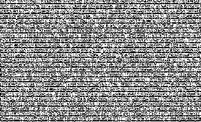
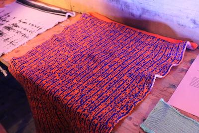

## asciimage

A program that converts ASCII text to binary, and to black & white pixels.

### Dependencies

Imagemagick:

    https://www.imagemagick.org

### Usage

Example:

    python asciimage.py leBreton.txt  200  binary.jpg

## Result

Binary output => knitted result:

